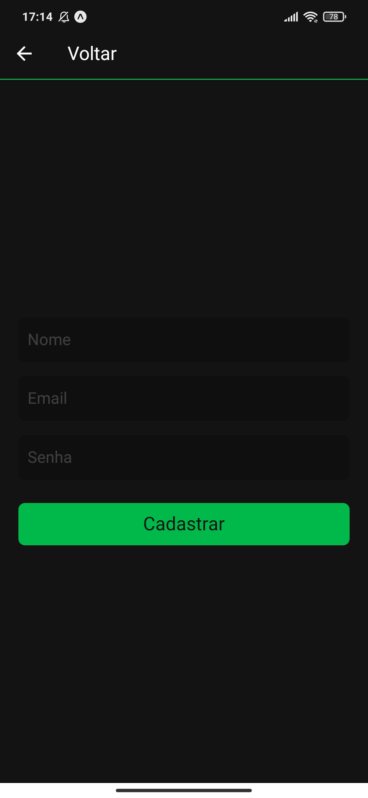
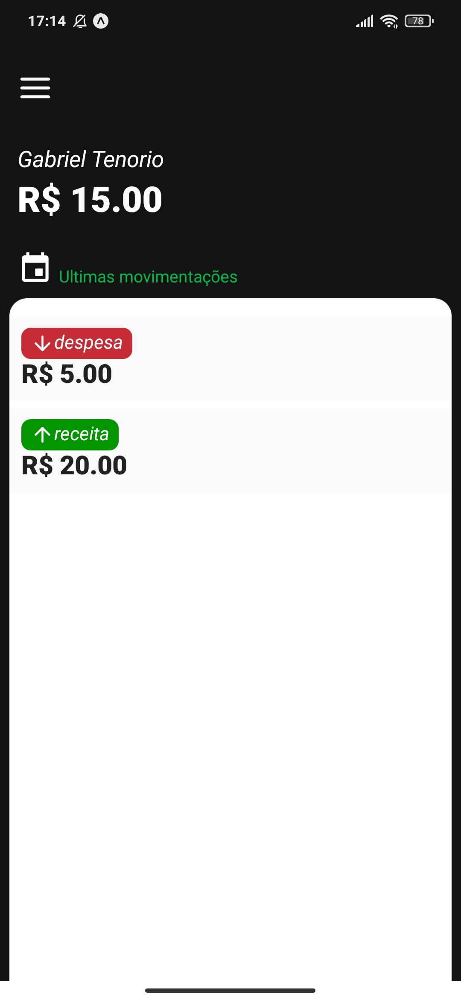
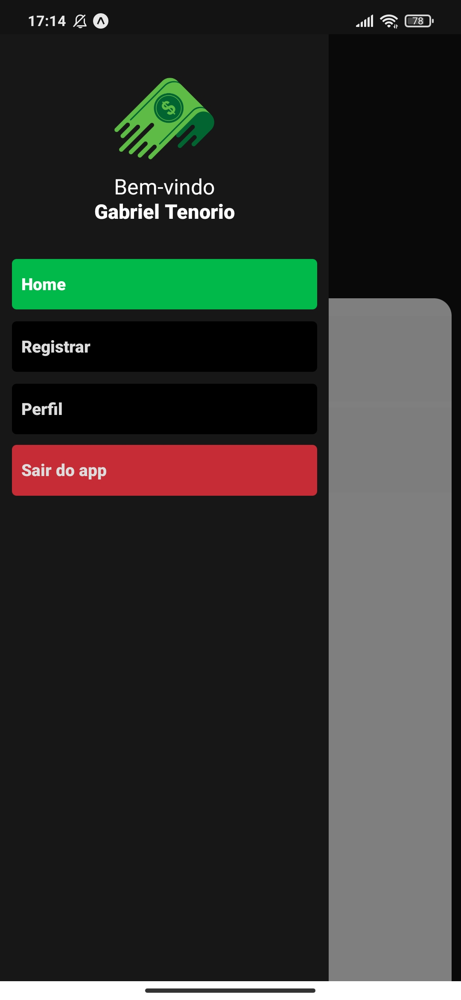
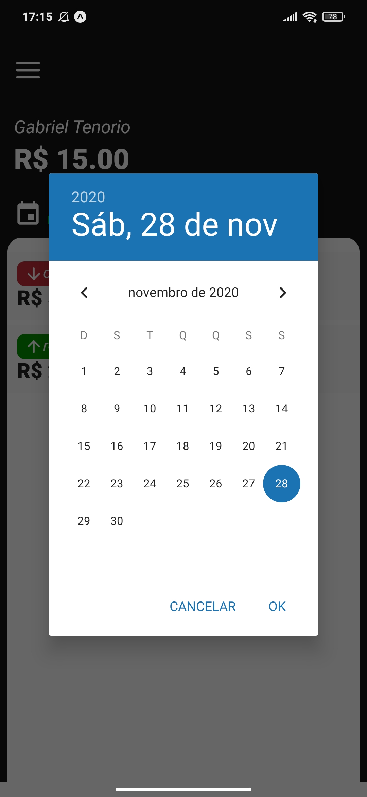

<h1 align="center"> 
    
  
   
   
  Finanças App
   
</h1>

### Descrição: Projeto de estudos do curso [Sujeito Programador](https://sujeitoprogramador.com/)

 
 

 
 
 

## 🚀 Technologies

This project was developed with the following technologies:

- ✔️ EXPO
- ✔️ React Native
- ✔️ React Hooks
- ✔️ Context API
- ✔️ Styled Components
- ✔️ Firebase
- ✔️ React Navigation

 

### Instagram: [@tenoriogah](https://www.instagram.com/tenoriogah)
